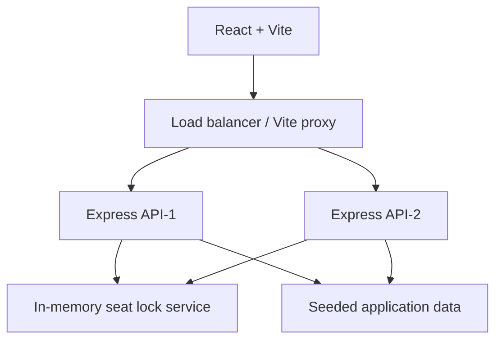

# SeatFlow

SeatFlow is a local-first event and movie booking MVP with original branding and a cinematic product UI. It includes discovery, event details, show selection, JWT auth, protected bookings, five-minute server-side seat holds, simulated checkout, admin analytics, and a load-balancer status view.

## What to say first

"SeatFlow is a ticket-booking platform designed around one important consistency problem: two people must not be able to purchase the same seat. The frontend is a React experience for discovery and checkout, while the Express API owns authentication, authorization, seat availability, temporary holds, and booking confirmation. I kept the MVP local-first so it can run with one command, but the service boundaries make the in-memory pieces replaceable with Redis and PostgreSQL in production."

## Run locally

Prerequisite: Node.js 18+ and npm.

```bash
npm install
npm run dev
```

Open `http://localhost:5173`. The Express API runs on port 4000. For another API instance, run `SERVER_ID=API-2 PORT=4001 npm run server` in a second terminal. On Windows PowerShell: `$env:SERVER_ID='API-2'; $env:PORT='4001'; npm run server`.

## Demo accounts

- User: `user@seatflow.com` / `User@123`
- Admin: `admin@seatflow.com` / `Admin@123`

## Architecture



The MVP uses in-memory data for zero-setup demos. The booking API validates ownership of every seat hold before creating a booking, then marks the seats booked and releases the lock. Production should replace the lock map with Redis `SET NX EX 300` and wrap booking finalization in a database transaction.

## How the demo works

### 1. Discovery

The React app loads `GET /api/events` when the home page opens. The API returns eight seeded experiences. Search is sent as a query parameter, and the category controls filter the visible event cards. Selecting a card stores the selected event in the client and opens its detail view.

### 2. Event and show selection

The detail view requests `GET /api/shows/:eventId`. Each show combines an event, venue, date, time, format, and price. The client displays the show choices, but the API remains the source of truth for the show data.

### 3. Authentication

When the user signs in, the API looks up the email and compares the submitted password with the bcrypt hash. It returns a JWT containing the user id, name, email, and role. The browser stores the token for this demo and sends it as:

```text
Authorization: Bearer <token>
```

The `auth` middleware verifies that token before allowing access to seats, bookings, or the current-user endpoint. The `admin` middleware checks the role again on admin APIs. Hiding an admin button in React is only a UI convenience; the backend authorization check is the real security boundary.

### 4. Seat map and temporary holds

The seat screen first calls `GET /api/shows/:showId/seats`, which returns all seat numbers plus the currently booked and held seats. Available, selected, held, and booked seats have separate visual states.

After the user selects seats, the client calls `POST /api/seats/lock`:

```json
{
  "showId": "s1a",
  "seatIds": ["A4", "A5"]
}
```

The server then:

1. Removes expired entries from the lock map.
2. Rejects seats that are already booked.
3. Rejects a seat held by a different user.
4. Creates a lock owned by the current user for five minutes.

This is why the frontend cannot simply mark seats as available and trust itself. Availability is checked on the server immediately before the hold is created.

### 5. Checkout and booking confirmation

Checkout calls `POST /api/bookings`. The API checks that every requested seat still has an unexpired lock owned by the current user. If even one lock is missing, the booking is rejected and the user must choose seats again.

For a valid booking, the API calculates the total, adds the seats to the booked set, deletes their temporary locks, creates a booking id such as `SF-2026-1042`, and returns the booking. The confirmation screen displays the event, venue, time, seat numbers, amount, and a demo QR-style graphic. No real payment is processed.

### 6. Booking history and admin view

`GET /api/bookings` returns only bookings owned by the signed-in user. Admin statistics use a separate protected endpoint and show seeded headline numbers plus live demo bookings. The admin screen also presents three healthy API nodes to explain the intended load-balanced deployment.

## Seat-locking example for an interview

Imagine User A and User B both click seat `A4` at nearly the same time. The first request creates the server-side lock `showId:A4` with User A and an expiry time. The second request sees that lock belongs to User A and receives:

```json
{
  "message": "Seat A4 is currently being held by another user."
}
```

If User A does not complete checkout within five minutes, the next seat request prunes the expired lock and `A4` becomes available again. In production, this map must move to Redis so API-1 and API-2 share the same lock state.

## Main data model

The seeded model is intentionally small:

| Entity | Important fields |
| --- | --- |
| User | id, name, email, passwordHash, role |
| Event | id, title, description, category, poster, rating |
| Venue | id, name, location |
| Show | id, eventId, venueId, date, time, price, format |
| Booking | id, userId, showId, seatIds, total, status |
| Seat lock | showId, seatId, userId, expiresAt |

The current implementation keeps these collections in memory because the goal is a fast, reliable demonstration. Restarting the server resets demo bookings and locks.

## Important design decisions

- **JWT and bcrypt:** passwords are hashed before storage, and the API returns safe user objects without password hashes.
- **Backend authorization:** user ownership and admin role checks happen in Express middleware and route handlers.
- **Server-owned pricing:** the booking endpoint calculates the total from the server-side show price instead of trusting a total from the browser.
- **Short-lived locks:** five minutes is enough to complete checkout without holding inventory indefinitely.
- **Simple local setup:** no Supabase, Redis, payment gateway, or external service is required for the demo.
- **Replaceable infrastructure:** the seat lock and data collections are isolated behind API behavior, so they can move to Redis/PostgreSQL without changing the booking journey.

## Known MVP boundaries

This is a demonstration build, not a payment or ticketing production system. Data is not durable between server restarts, the QR graphic is illustrative, rate limiting and Helmet are not wired in, and the API instances do not share memory. Those are deliberate scope decisions for the time constraint. The production version would add PostgreSQL transactions, Redis locks, payment webhooks, refresh-token or secure-cookie handling, validation schemas, rate limiting, audit logs, and monitoring.

## API surface

`POST /api/auth/register`, `POST /api/auth/login`, `GET /api/auth/me`, `GET /api/events`, `GET /api/events/:id`, `GET /api/shows/:eventId`, `GET /api/shows/:showId/seats`, `POST /api/seats/lock`, `POST /api/bookings`, `GET /api/bookings`, `GET /api/admin/stats`, and `GET /api/health`.

## How I would scale this system

Client -> load balancer -> multiple API instances -> Redis distributed locks -> PostgreSQL. Add connection pooling, caching for event/show reads, message queues for notifications, horizontal scaling, rate limiting, structured logs, metrics, and tracing. Redis is important because an in-memory map cannot coordinate locks across multiple API processes.

## 5-minute demo script

1. Browse the home page and search/filter the seeded catalogue.
2. Open Interstellar, choose a show, sign in with the demo user, and select multiple seats.
3. Show the live seat states and total, then complete the simulated payment.
4. Open My bookings and show the booking ID and ticket details.
5. Sign out, sign in as admin, and show KPIs, event catalogue, and API-1/API-2/API-3 health.
6. Explain that the local lock is intentionally replaceable with Redis for distributed production instances.

## Interview questions you can answer

**Why is seat locking done on the backend?**  Because the browser is untrusted and multiple users can make requests concurrently. Only the server can coordinate inventory consistently.

**Why not mark the seat booked when it is selected?**  Selection is not payment. A temporary hold prevents a race during checkout while allowing abandoned carts to expire.

**What would change for multiple API instances?**  Move locks to Redis with an atomic `SET NX EX` operation, use PostgreSQL transactions when converting holds to bookings, and put the instances behind the included nginx upstream.

**What happens if checkout is attempted after expiry?**  The booking endpoint verifies lock ownership and expiry. It returns a conflict response instead of creating a booking.

**What is protected?**  Registration and browsing are public. Seat locking, checkout, booking history, and the current-user endpoint require JWT authentication. Statistics require both authentication and the `ADMIN` role.
